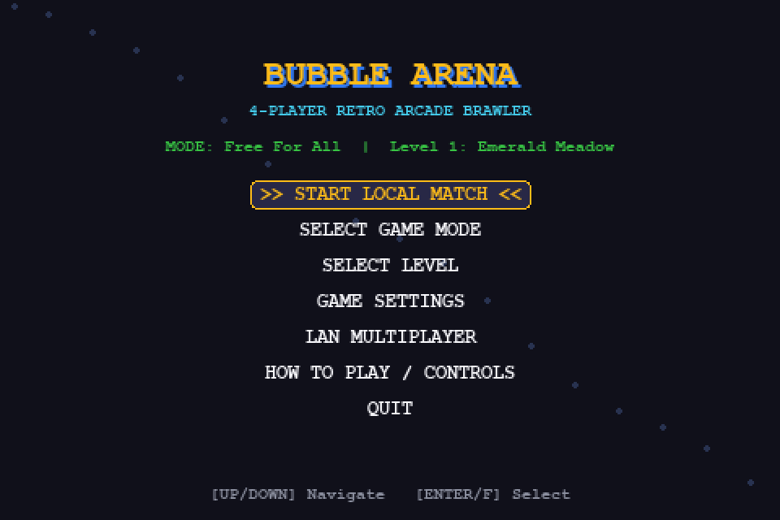
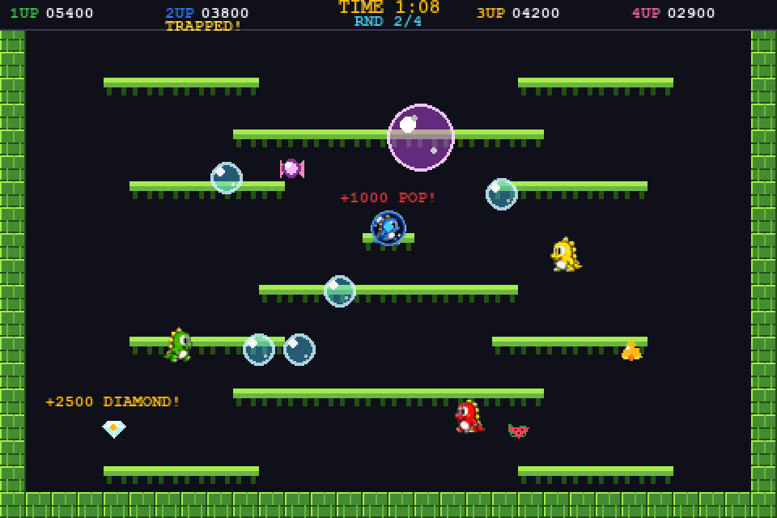
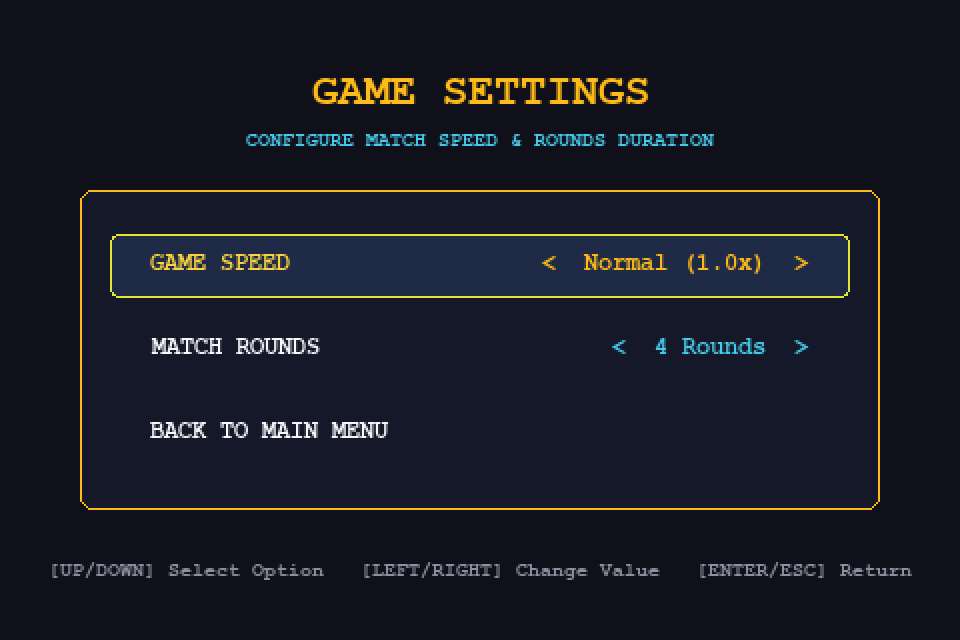
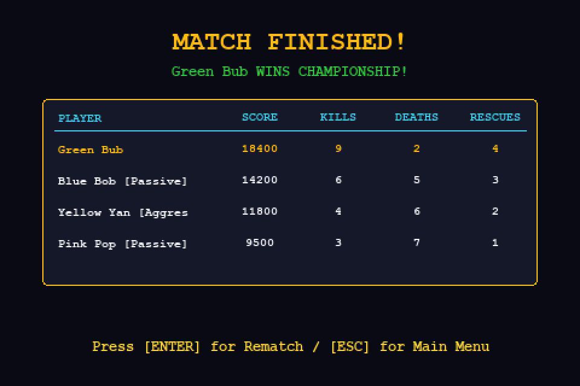
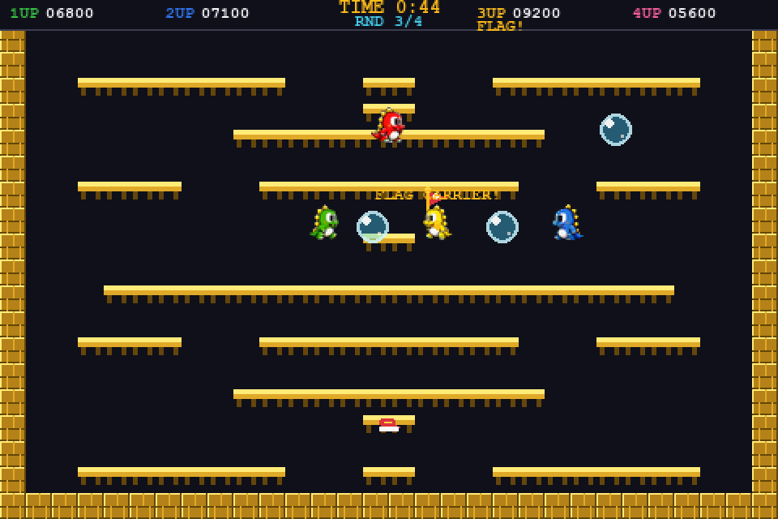
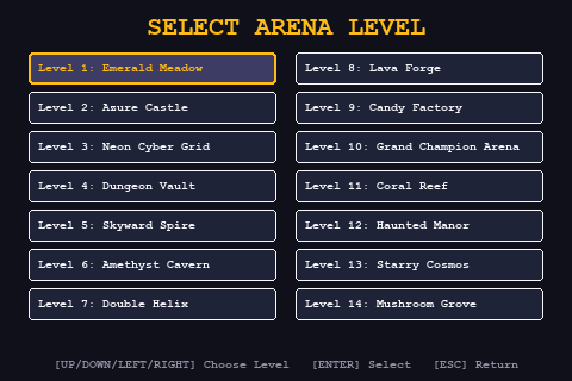
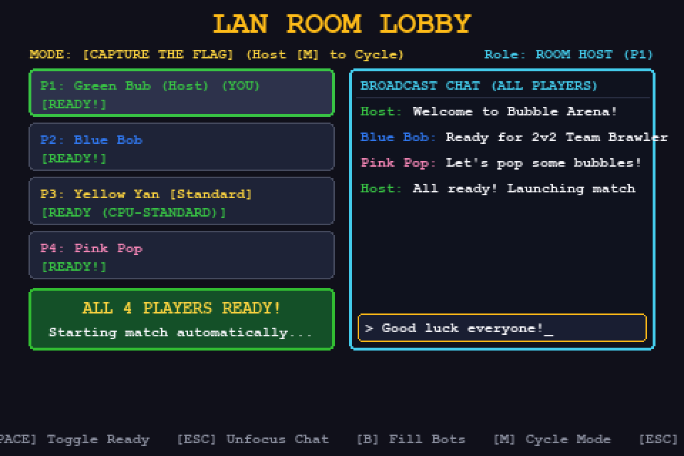

# 🫧 BUBBLE ARENA - Game Design Document & Technical Specification

> **A fast-paced 4-player retro 2D single-screen arcade platform brawler inspired by *Bubble Bobble*, featuring competitive local & LAN multiplayer, chain-reaction bubble explosions, 14 arena stages, ready-checked lobbies, and in-game broadcast chat.**

<p align="center">
  
  
</p>

---

## 📖 Table of Contents
1. [Game Overview](#-game-overview)
2. [Core Game Design & Pillars](#-core-game-design--pillars)
3. [Gameplay Mechanics & Controls](#-gameplay-mechanics--controls)
4. [Game Settings & Match Customization](#-game-settings--match-customization)
5. [Game Modes](#-game-modes)
6. [Arenas & Stage Themes](#-arenas--stage-themes)
7. [Items, Power-Ups & Collectibles](#-items-power-ups--collectibles)
8. [LAN Multiplayer & Networking Architecture](#-lan-multiplayer--networking-architecture)
9. [Headless Dedicated Console Server](#-headless-dedicated-console-server-linux-freebsd--windows)
10. [Codebase Architecture & Class Hierarchy](#-codebase-architecture--class-hierarchy)
11. [Installation, Running & Building](#-installation-running--building)
12. [Automated Test Suite](#-automated-test-suite)

---

## 🎮 Game Overview

**Bubble Arena** is an arcade-style competitive platformer built with **Python 3** and **Pygame 2**. Players take control of colorful dragon-like bubblers who trap opponents inside bubbles, ride bubbles to reach elevated platforms, and trigger cascading chain-reaction explosions to rack up high scores and claim victory.

- **Target Resolution:** Virtual screen at `480 × 320` scaled with crisp nearest-neighbor pixel preservation to `960 × 640` (2x window).
- **Target Frame Rate:** 60 FPS deterministic simulation.
- **Audio:** Custom procedural 8-bit chiptune sound synthesis and multi-voice dynamic background music without external asset dependencies.
- **Visuals:** High-contrast 16-color retro arcade palette with custom animated sprite-sheets and procedural fallbacks.

---

## 🏛️ Core Game Design & Pillars

1. **Classic Arcade Accessibility with High Skill Ceiling:**
   - Simple, responsive controls (WASD / Arrows + Jump + Shoot).
   - Advanced movement: bubble trampoline hopping, corner-cutting ledge jumps, jump buffering, and coyote grace time.
2. **Chain-Reaction Explosions:**
   - Popping a bubble triggers a cascade that detonates all touching and adjacent bubbles, awarding compounding combo multipliers (`x2`, `x3`, `x4+`).
3. **Dynamic Arena Flow:**
   - 3-minute global match timer.
   - At 30 seconds remaining, the game triggers a high-tempo **"HURRY UP!"** mode with fast music.
   - Random stage selection on match start and rematches.
4. **Cooperative & Competitive Versatility:**
   - Single keyboard 4-player local multiplayer.
   - Full LAN multiplayer with network adapter selection, 4-player ready check lobby, and broadcast chat.

---

## 🕹️ Gameplay Mechanics & Controls

### 1. Platforming & Movement
- **One-Way Platforms:** Players jump smoothly through platforms from underneath and land securely on top.
- **Jump Buffering (140ms):** Pressing jump right before touching the floor queues the jump for immediate execution upon landing.
- **Coyote Time (100ms):** Allows jumping for a brief fraction of a second after stepping off a platform ledge.

### 2. Bubble Physics & Trapping
- **Phase 1: Horizontal Shot:** Bubbles fire forward horizontally at high speed (`280 px/s`). Hitting an opponent traps them inside.
- **Phase 2: Buoyant Drift & Sway:** Once bubbles travel their distance or hit a side brick wall, they rise upward (`-35 px/s`) with sinusoidal sway.
- **Bubble Riding (Trampoline):** Players can land on top of any floating bubble to bounce upward and reach higher arena tiers.
- **Timeout & Struggle Escape:** Bubbles have a 30-second lifespan. Warning flashes begin at 24 seconds. Trapped players can mash action buttons to break out early.
- **Elimination & Teammate Rescue:**
  - **Opponent Pop:** Touching or head-butting an enemy trapped bubble eliminates the player (+1,000 pts).
  - **Teammate Rescue:** In 2v2 mode, touching a teammate's bubble instantly frees and shields them (+500 pts).

### 3. Controls Mapping

#### Single Keyboard 4-Player Layout:
| Player | Color | Movement | Jump | Shoot / Struggle | Action |
|---|---|---|---|---|---|
| **Player 1** | Green | `W, A, S, D` or `Arrows` | `SPACE`, `W`, `UP` | `F`, `J`, `Z`, `ENTER` | `G` |
| **Player 2** | Blue | `Arrow Keys` | `UP Arrow` | `K` | `L` |
| **Player 3** | Yellow | `I, J, K, L` | `I` | `U` | `O` |
| **Player 4** | Pink | `Numpad 8, 4, 5, 6` | `Numpad 8` | `Numpad 7` | `Numpad 9` |

#### Gamepad Support:
- Plug-and-play support for up to 4 standard USB / Bluetooth controllers:
  - **Move:** D-Pad or Left Analog Stick
  - **Jump:** `A` / Cross button
  - **Shoot / Struggle:** `X` / Square or `B` / Circle button

---

## ⚙️ Game Settings & Match Customization

Configurable directly from the title screen under **GAME SETTINGS**:

### 1. Game Speed Multiplier
- **`Slower (0.8x)`**: Relaxed pacing, suited for tactical positioning and beginner practice.
- **`Normal (1.0x)`**: Default authentic arcade brawler speed (standard 60 FPS physics).
- **`Faster (1.25x)`**: Fast-paced turbo speed for experienced brawlers and rapid reflexes.
*Note: Scales game physics, timers, cooldowns, and bubble velocities proportionally while preserving smooth 60 FPS animation rendering.*

### 2. Configurable Match Rounds
- Adjust match duration from **1 to 10 rounds** (default: **4 rounds**).
- Cumulative statistics (Score, Kills, Deaths, and Rescues) are preserved across rounds.
- Top HUD displays live round progress: `RND X/Y`.
- Mid-match round transitions display a stylish arcade celebration banner announcing the upcoming round.

### 3. Justified Match Results Scoreboard
- At the conclusion of the final round, the **MATCH FINISHED!** celebration renders a table with strictly justified columns:
  - `PLAYER`: Player identity and nickname
  - `SCORE`: Cumulative score points
  - `KILLS`: Trapped bubble eliminations
  - `DEATHS`: Times eliminated
  - `RESCUES`: Friendly bubble pops (2v2 Team Brawler)

<p align="center">
  
  
</p>

---

## 🏆 Game Modes

1. **Free-For-All (FFA):**
   - 4-player solo deathmatch. Every bubbler for themselves. Highest score when timer expires wins.
2. **2v2 Team Brawler:**
   - Team Green/Yellow vs. Team Blue/Pink. Friendly bubble pops rescue teammates with temporary shields.
3. **Capture The Flag (CTF):**
   - A golden flag spawns in the arena. Holding the flag awards accumulating points over time. Eliminating the flag-carrier forces a drop.
4. **Single-Player / Practice vs. AI Bots:**
   - Play locally against heuristic bots equipped with autonomous pathfinding, bubble-shooting, and bubble-riding logic.

<p align="center">
  
</p>

---

## 🗺️ Arenas & Stage Themes

Bubble Arena features **14 handcrafted single-screen maps**, each featuring distinct platform configurations and visual themes. In the **SELECT LEVEL** menu, all 14 stages are displayed in an interactive 2-column $\times$ 7-row grid with clean arrow-key navigation (Left/Right jumps between columns, Up/Down steps through stages):

<p align="center">
  
</p>

1. **Emerald Meadow:** Classic multi-tiered grassland with central climbing gaps.
2. **Azure Castle:** Fortified stone battlements with tall side watchtowers.
3. **Neon Cyber Grid:** High-tech digital grid with narrow speed platforms.
4. **Dungeon Vault:** Heavy stone brick platforms and close-quarters combat lanes.
5. **Skyward Spire:** Vertical platform columns emphasizing bubble-riding ascension.
6. **Amethyst Cavern:** Crystal caverns with stepped diagonal walkways.
7. **Double Helix:** Intertwined winding ramps requiring precision jumping.
8. **Lava Forge:** Heated subterranean foundry with suspended platform bridges.
9. **Candy Factory:** Bright pastel confectionery ledges with wide float zones.
10. **Grand Champion Arena:** Symmetrical tournament stage designed for pure competitive combat.
11. **Coral Reef:** Deep-sea oceanic tiers with wide bubble drift currents.
12. **Haunted Manor:** Gothic Victorian architecture with floating platforms.
13. **Starry Cosmos:** Celestial platforms suspended in deep space.
14. **Mushroom Grove:** Organic fungal canopy with tiered caps.

---

## 🍬 Items, Power-Ups & Collectibles

Items spawn randomly during matches or drop from popped bubble chain explosions:

### Combat Power-Ups:
- 👟 **Fast Shoes (12s):** Increases movement speed by +40%.
- 🍬 **Blue Candy (15s):** Extends bubble shot horizontal distance by +60%.
- 🍭 **Yellow Candy (15s):** Enables rapid-fire shooting cooldown (`0.16s` vs `0.35s`).
- 🔮 **Purple Mega Candy (30s):** Shoots **2x Giant Bubbles** (`24px` radius) with massive capture hitboxes!
- ⭐ **Star Shield (6s):** Grants temporary invulnerability and auto-pops touching bubbles.

### Score Collectibles:
- 💎 **Diamond:** +2,500 pts
- 💠 **Ruby Gem:** +1,500 pts
- 🔔 **Golden Bell:** +2,000 pts
- 🍉 **Watermelon:** +800 pts
- 🍌 **Banana:** +700 pts
- 🍇 **Grapes:** +600 pts
- 🍎 **Red Apple:** +500 pts
- 🥕 **Carrot:** +400 pts

---

## 🌐 LAN Multiplayer & Networking Architecture

```
                       +-------------------------+
                       |    LAN Server (Host)    |
                       |  - Interface Selector   |
                       |  - UDP Discovery Beacon |
                       |  - TCP Non-Blocking Hub |
                       +------------+------------+
                                    |
          +-------------------------+-------------------------+
          |                         |                         |
+---------v---------+     +---------v---------+     +---------v---------+
|   Client 1 (P2)   |     |   Client 2 (P3)   |     |   Client 3 (P4)   |
| TCP Input & State |     | TCP Input & State |     | TCP Input & State |
+-------------------+     +-------------------+     +-------------------+
```

### 1. Network Interface Selection
- Automatically enumerates all available physical and virtual IPv4 interfaces (e.g. `192.168.0.100`, `10.100.101.10`, `127.0.0.1`).
- The host can cycle and bind to any specific network adapter from the LAN setup menu.
- Advertises the selected host address via UDP discovery beacons (`PORT 28889`).

### 2. Dedicated 4-Player Room Lobby & Ready System
- Hosting does not immediately launch into the game; instead, it enters the **LAN Room Lobby**.
- Displays 4 player slot cards (P1 Green, P2 Blue, P3 Yellow, P4 Pink) with connection state and ready status.
- Each human player toggles **`[READY]`** with `[R]` or `[SPACE]`.
- Host can fill open slots with AI Bots using `[B]`.
- **Match Auto-Start:** When all 4 slots are occupied and marked **`READY`**, the match starts synchronously for all players.

<p align="center">
  
</p>

### 3. Generic Broadcast Chat
- Built-in real-time lobby chat.
- Players press `[TAB]` or `[C]` to focus the chat input bar, type messages (up to 32 characters), and press `[ENTER]` to send.
- Messages are broadcast to all connected clients and displayed with sender player colors.

---

## 🖥️ Headless Dedicated Console Server (Linux, FreeBSD & Windows)

Bubble Arena includes a standalone, 100% headless dedicated server (`bubblearena_server.py`) powered by the unified [`network/server_core.py`](file:///c:/Temp/BubbleArena/network/server_core.py) library.

### 💡 Key Design & Features:
- **Zero GUI / Audio Dependencies**: Pure Python standard library (`socket`, `select`, `threading`, `argparse`, `signal`, `json`). Requires no Pygame, SDL, X11, Wayland, or sound drivers. Ideal for remote Linux VPS, FreeBSD jails, cloud servers, or Docker containers.
- **Dedicated Slot Allocation**: All 4 player slots (Slots 0..3) are available for remote clients to join (unlike listen-hosts where Slot 0 is reserved for local player P1).
- **Live Ping & Latency Monitoring**: Automatically calculates round-trip latency in milliseconds ($RTT$) for each connected client and displays live metrics in the console.
- **Interactive Managerial Console Shell**: Real-time CLI administrative controls (`status`, `kick`, `ban`, `mode`, `level`, `bot`, `say`, etc.).
- **IP Blacklist / Ban System**: Automatically refuses connections from banned IPs and disconnects active clients instantly.

---

### 📦 Minimal Dedicated Server Deployment (Headless VPS / Linux / FreeBSD)

To run a dedicated server on a remote Linux VPS or FreeBSD machine, **you do NOT need to transfer graphics, audio, or game client files**. The dedicated server runs 100% headless using only the Python standard library, requiring only **4 files** with a total footprint under **50 KB**:

#### Required Directory & File Structure:
```
bubblearena_server/
├── bubblearena_server.py      # Server entry point & interactive admin shell
├── constants.py               # Network ports, game modes, and bot personalities
└── network/
    ├── __init__.py            # Standard Python package marker (empty file)
    ├── protocol.py            # JSON newline-delimited network protocol
    └── server_core.py         # Unified BaseBubbleServer engine & client socket manager
```

#### Quick Deployment Script:
To prepare and package only the minimal dedicated server files from the repository:
```bash
# Create minimal deployment bundle
mkdir -p bubblearena_server/network
cp bubblearena_server.py bubblearena_server/
cp constants.py bubblearena_server/
touch bubblearena_server/network/__init__.py
cp network/protocol.py bubblearena_server/network/
cp network/server_core.py bubblearena_server/network/

# Transfer to remote machine (example via rsync / scp)
rsync -avz bubblearena_server/ user@your-remote-server:/opt/bubblearena_server/
```

On the remote machine, simply execute:
```bash
cd /opt/bubblearena_server
python3 bubblearena_server.py -i 0.0.0.0 -p 28888 --no-beacon
```
*No Pygame, SDL, X11, Wayland, audio drivers, or graphic assets required!*

---

### 🚀 Starting the Dedicated Server

```bash
# Listen on all interfaces (0.0.0.0) on default port 28888 in Free-For-All mode
python bubblearena_server.py

# Listen on a specific interface IP and custom port
python bubblearena_server.py -i 192.168.1.100 -p 29999 -m team -l 5

# Public Internet server (disables local UDP discovery beacon)
python bubblearena_server.py -i 0.0.0.0 -p 28888 -m ctf --no-beacon
```

#### Command-Line Arguments:
| Flag | Description | Default |
| :--- | :--- | :--- |
| **`-i, --interface`** | Interface IP to bind (`0.0.0.0` for all interfaces, `127.0.0.1`, or specific IP) | `0.0.0.0` |
| **`-p, --port`** | Port number to listen on | `28888` |
| **`-m, --mode`** | Initial game mode (`ffa`, `team`, `ctf`) | `ffa` |
| **`-l, --level`** | Initial stage level (`1`..`14`) | `1` |
| **`--no-beacon`** | Disable UDP LAN discovery beacon (recommended for remote VPS) | Beacon enabled |
| **`--no-auto-start`** | Disable automatic match launch when all 4 slots are ready | Auto-start enabled |

---

### 🕹️ Administrative Console Commands

When running interactively, administrators have full control over the match and players directly from the terminal prompt (`bubblearena-srv> `):

| Command | Arguments | Description & Example |
| :--- | :--- | :--- |
| **`status`** / **`st`** | *(none)* | Displays comprehensive ASCII dashboard (uptime, mode, level, all 4 slots with IP, ping, status). |
| **`players`** / **`pl`** | *(none)* | Compact list of connected players, IP:port, and ping latency in milliseconds. |
| **`kick`** | `<slot 1-4 \| name> [reason]` | Kicks a player and resets their slot. Example: `kick 2 AFK in lobby` |
| **`ban`** | `<ip_address>` | Blacklists an IP address and immediately disconnects matching clients. Example: `ban 192.168.1.50` |
| **`unban`** | `<ip_address>` | Removes an IP address from the blacklist. Example: `unban 192.168.1.50` |
| **`bans`** | *(none)* | Lists all currently blacklisted IP addresses. |
| **`mode`** | `<ffa \| team \| ctf>` | Changes the active game mode and synchronizes with all clients in the lobby. |
| **`level`** | `<1..14>` | Sets the active arena stage (1-14). Example: `level 4` |
| **`bot add`** | `[slot 1-4] [personality]` | Adds a bot (`Aggressive`, `Passive`, `Standard`) to an open slot. Example: `bot add 2 Aggressive` |
| **`bot kick`** | `<slot 1-4>` | Removes a bot from the specified slot. Example: `bot kick 2` |
| **`bots fill`** | *(none)* | Immediately fills all open slots with random personality CPU bots. |
| **`say`** | `<message>` | Broadcasts a `[SERVER]` announcement to all players in the lobby chat. |
| **`start`** | *(none)* | Force-starts the match immediately for all connected players. |
| **`autostart`** | `<on \| off>` | Toggles automatic match start when all 4 slots become ready. |
| **`interfaces`** | *(none)* | Displays all detected local network interfaces and IPs. |
| **`clear`** | *(none)* | Clears the terminal screen. |
| **`help`** / **`?`** | *(none)* | Displays the command reference guide. |
| **`stop`** / **`quit`** | *(none)* | Gracefully notifies all clients and shuts down the server. |

---

### 🌐 Connecting Clients to Dedicated Server (LAN or Internet)

#### Option 1: Command-Line Launch
Launch the client and connect directly to a remote dedicated server over LAN or Internet:
```bash
python main.py --join 83.212.19.100:28888
# or
./Releases/BubbleArena.exe --join 83.212.19.100:28888
```

#### Option 2: In-Game Menu
1. From the title screen, select **LAN MULTIPLAYER**.
2. Select **4. DIRECT CONNECT TO IP/HOST: < 127.0.0.1 >**.
3. Use `[<- / ->]` to cycle through discovered hosts, local interfaces, or press `ENTER` to connect directly to the target server.

---

### 🐧 Running as a Linux Systemd Service or FreeBSD Daemon

#### Systemd Service Unit (`/etc/systemd/system/bubblearena.service`):
```ini
[Unit]
Description=Bubble Arena Dedicated Headless Server
After=network.target

[Service]
Type=simple
User=gameserver
WorkingDirectory=/opt/BubbleArena
ExecStart=/usr/bin/python3 /opt/BubbleArena/bubblearena_server.py -i 0.0.0.0 -p 28888 --no-beacon
Restart=always
RestartSec=5

[Install]
WantedBy=multi-user.target
```

Enable and start the service:
```bash
sudo systemctl daemon-reload
sudo systemctl enable --now bubblearena
sudo systemctl status bubblearena
```

#### FreeBSD / Background Execution via `tmux` or `nohup`:
```bash
# Using tmux (recommended for remote console access)
tmux new -s bubblearena
python3 bubblearena_server.py -i 0.0.0.0 -p 28888 --no-beacon
# Detach with Ctrl+B then D, reattach with: tmux attach -t bubblearena

# Or using nohup in background:
nohup python3 bubblearena_server.py -i 0.0.0.0 -p 28888 --no-beacon > server.log 2>&1 &
```

---

## 📁 Codebase Architecture & Class Hierarchy

```
BubbleArena/
├── main.py                  # Client entrypoint & CLI argument parser
├── bubblearena_server.py    # Standalone headless dedicated console server (Linux/FreeBSD/Windows)
├── constants.py             # Global constants, physics, colors, keybindings, states
├── Releases/
│   └── BubbleArena.exe      # Pre-packaged standalone Windows release binary
├── engine/
│   ├── game.py              # GameEngine: State machine, loop, collisions, rendering
│   ├── bot_ai.py            # BotAI: Personalities, navigation, flag & bonus tactics
│   ├── input_handler.py     # Keyboard & Gamepad polling, jump buffer, coyote timers
│   ├── sprites.py           # SpriteManager: Pixel-art generator & sheet slicer
│   ├── sound.py             # SoundManager: Procedural 8-bit sound synthesizer & BGM
│   └── particles.py         # ParticleManager: Floating combat text & pop bursts
├── entities/
│   ├── player.py            # Player entity: Platformer physics, animations, buffs
│   ├── bubble.py            # Bubble entity: Burst horizontal flight & float sway
│   ├── trapped_bubble.py    # TrappedBubble: Entrapment, struggle, pop elimination
│   ├── powerup.py           # PowerUp: Collectibles, fruits, candies, shields
│   └── flag.py              # Flag: Capture-The-Flag pickup & drop mechanics
├── levels/
│   ├── level_data.py        # ASCII matrix maps for all 14 stages
│   └── level_manager.py     # LevelManager: Map parsing, platforms, spawn points
├── modes/
│   ├── game_mode.py         # BaseGameMode: Common scoring & timer interface
│   ├── ffa_mode.py          # FFAMode: Solo free-for-all deathmatch rules
│   ├── team_mode.py         # TeamMode: 2v2 team brawler rules & rescue tracking
│   └── ctf_mode.py          # CTFMode: Flag-holding scoring & drop rules
├── network/
│   ├── protocol.py          # JSON newline-delimited packet serialization
│   ├── server_core.py       # BaseBubbleServer: Unified network core, ping latency, kick/ban
│   ├── lan_server.py        # LANServer: Listen-host subclass for local lobbies
│   └── lan_client.py        # LANClient: Non-blocking client & ping/pong latency responder
├── ui/
│   ├── hud.py               # HUD: Scores, timer, level name, hurry-up banners
│   └── menu.py              # MenuSystem: Title, mode select, level select, lobbies
└── tests/                   # Automated unittest suite (64 tests)
```

---

## 🚀 Installation, Running & Building

### Requirements
- Python 3.10+
- Pygame 2.5+ (`pip install pygame`)

### 1. Launch Main Menu
```bash
python main.py
```

### 2. Launch Local Bot Match
```bash
python main.py --bots --mode ffa --level 1
```

### 3. Build Standalone Windows Executable
To package the game as a single standalone `.exe` with all assets included:
```bash
# Automated batch script (builds and outputs to Releases\BubbleArena.exe)
build_exe.bat

# Or manual PyInstaller command:
pyinstaller --noconfirm --clean --onefile --name "BubbleArena" --add-data "assets;assets" --add-data "Animation;Animation" --collect-all pygame main.py
```
The official release executable is located in:
**`Releases/BubbleArena.exe`**

---

## 🧪 Automated Test Suite

Bubble Arena includes a comprehensive suite of 64 automated unit and integration tests:

```bash
python -m unittest discover tests
```

### Test Coverage:
- **`test_game.py`**: Physics, platform collisions, jump mechanics, one-way floors, scoring.
- **`test_boundaries_and_controls.py`**: Screen border containment, multi-key bindings, jump buffering.
- **`test_lan_lobby.py`**: Network adapter enumeration, ready state machine, broadcast chat, and trapped bubble elimination state.
- **`test_dedicated_server.py`**: Headless dedicated server (`bubblearena_server.py`), CLI argument parser, 4-player dedicated slot allocation, ping/latency tracking, administrative commands (`status`, `kick`, `ban`, `mode`, `level`, `bot`, `say`), and IP blacklist rejection.
- **`test_platform_edge.py`**: Platform edge boundary alignment and precision landing.
- **`test_sprites.py`**: Sprite sheet parsing and character frame animations.
- **`test_simulation.py`**: 150-frame end-to-end game simulation across all 3 game modes.
- **`test_bot_personalities.py`**: AI decision engine, personality archetypes (Aggressive, Passive, Standard), CTF retrieval/carrier delivery tactics, team rescue priorities, and bonus utility appraisal.
- **`test_player_count_and_lan_modes.py`**: Local human count ratios (1-4 players + bots), LAN game mode cycling & sync, and sound card silent-mode fallback.

---

## 🤖 Computer Player AI & Personalities

Bubble Arena features a dedicated decision engine ([`engine/bot_ai.py`](file:///c:/Temp/BubbleArena/engine/bot_ai.py)) with three distinct personality profiles:

| Personality | Combat Style | Bonus Appraisal | Game Mode Tactics |
| :--- | :--- | :--- | :--- |
| **Aggressive** | Relentlessly chases closest opponent; rapid bubble fire; prioritizes popping trapped foes | Pursues combat buffs (Shield, Giant Candy, Speed); **skips bonuses** when locked on an urgent target | **CTF**: Hunts enemy flag carrier relentlessly to force drop; charges defenders when escorting.<br>**Team**: Focuses on eliminating trapped enemies. |
| **Passive** | Keeps safe distance; flees if enemy is within 85px; uses defensive covering fire | High priority on **Star Shield**; **skips bonuses** if enemies are nearby; gathers safe items on empty tiers | **CTF**: Intercepts from elevated platforms; guards base; takes high stealth routes when carrying.<br>**Team**: High rescue priority for trapped allies. |
| **Standard** | Balanced tactical navigation; bubble bouncing; opportunist attacks | Balanced utility formula (`utility - distance`); detours for gems/candies $\ge 70$ utility | **CTF**: Balances flag grabbing, intercepting, and escorting.<br>**Team**: Rescues allies about to expire, else pops foes. |

---

---

## 🌐 Remote GitHub Repository & Custom Token Configuration

The local repository is connected to the remote GitHub repository at:
**`https://github.com/mdasyg/bubblearena.git`**

### 🔑 Custom Token Authentication & Required Security Scopes

When connecting local repositories or automated AI agents to GitHub using a custom Personal Access Token (PAT), specific security permissions must be granted to enable **Pull**, **Commit**, **Push**, and **Merge** operations while preserving the principle of least privilege.

#### 1. Fine-Grained Personal Access Token (Recommended)
Navigate to **GitHub $\rightarrow$ Settings $\rightarrow$ Developer Settings $\rightarrow$ Personal Access Tokens $\rightarrow$ Fine-grained tokens**:

- **Token Name**: e.g., `BubbleArena-Agent-Token`
- **Expiration**: As required (e.g., 90 days or custom)
- **Repository Access**: **Only select repositories** $\rightarrow$ select **`bubblearena`** (restricts token blast radius).
- **Required Repository Permissions**:

| Security Permission | Access Level | Operations Allowed | Purpose & Rationale |
| :--- | :--- | :--- | :--- |
| **`Contents`** | **Read and write** | `git pull`, `git fetch`, `git push`, `git merge`, commits, branches | **Required**. Allows downloading repository code/objects, creating and pushing local commits, creating branches, fast-forwarding, and merging branches into `main`. |
| **`Metadata`** | **Read-only** | Repository metadata discovery | **Mandatory default**. Required by GitHub API for any interaction with the repository (commit hashes, ref lookups, default branch). |
| **`Pull requests`** | **Read and write** | Create, review, update, and merge PRs | **Required for PR workflows**. Allows agents and developers to open pull requests, request reviews, and merge PRs via GitHub CLI (`gh pr create`, `gh pr merge`) or API. |
| **`Workflows`** | **Read and write** *(Optional)* | Update GitHub Actions workflows | Only required if editing `.github/workflows/*.yml` automation pipelines. |

---

#### 2. Classic Personal Access Token (Legacy Alternative)
Navigate to **GitHub $\rightarrow$ Settings $\rightarrow$ Developer Settings $\rightarrow$ Personal Access Tokens $\rightarrow$ Tokens (classic)**:

- Select scopes:
  - **`repo`** (Full control of private repositories):
    - `repo:status` — Access commit status
    - `repo_deployment` — Access deployment status
    - `public_repo` — Access public repositories
    - `repo:invite` — Access repository invitations
    - `security_events` — Read/write security events
  *(Note: If the repository is strictly **public**, checking only **`public_repo`** is sufficient for pulling, pushing, and merging code).*

---

### 🛠️ How Local Repository Was Linked to Remote

#### Step 1: Remote URL Setup with Token
To link the local repository with the remote and embed credentials securely:

```powershell
# Method A: Using Git Credential Manager (Recommended - prevents token exposure in config)
git remote add origin https://github.com/mdasyg/bubblearena.git
git config --global credential.helper manager
# On first push, Git Credential Manager securely prompts for username and PAT

# Method B: Direct URL Authentication
git remote set-url origin https://<YOUR_GITHUB_TOKEN>@github.com/mdasyg/bubblearena.git
```

#### Step 2: Establish Default Branch and Upstream
```powershell
git branch -M main
git push -u origin main
```

---

### 🔄 Multi-Agent & Developer Collaboration Workflow

To prevent merge conflicts and ensure clean synchronization across multiple developers and AI agents, follow this required cycle:

```text
[ START TASK ] ────> 1. git pull (fetch latest remote state)
                           │
                           ▼
                      2. Make code edits & verify tests
                           │
                           ▼
                      3. git commit (local version control)
                           │
                           ▼
[ FINISH TASK ] ───> 4. git push (sync commits to remote origin)
```

#### Convenient CLI Commands:
- **Pull latest changes (Run FIRST before starting work)**:
  ```powershell
  python git_tool.py pull
  # or: git pull origin main
  ```

- **Run test verification**:
  ```powershell
  python -m unittest discover tests
  ```

- **Commit local changes**:
  ```powershell
  python git_tool.py commit "Description of features or bugfixes"
  ```

- **Push changes to remote (Run AFTER finishing work)**:
  ```powershell
  python git_tool.py push
  # or: git push origin main
  ```
